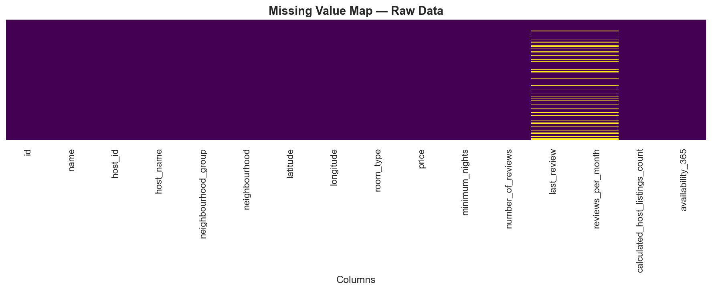
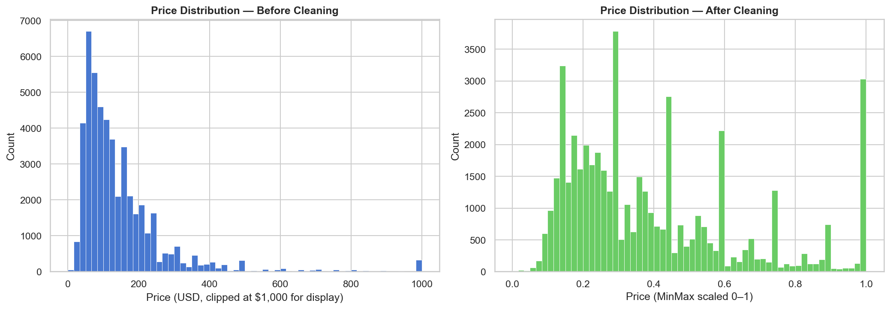
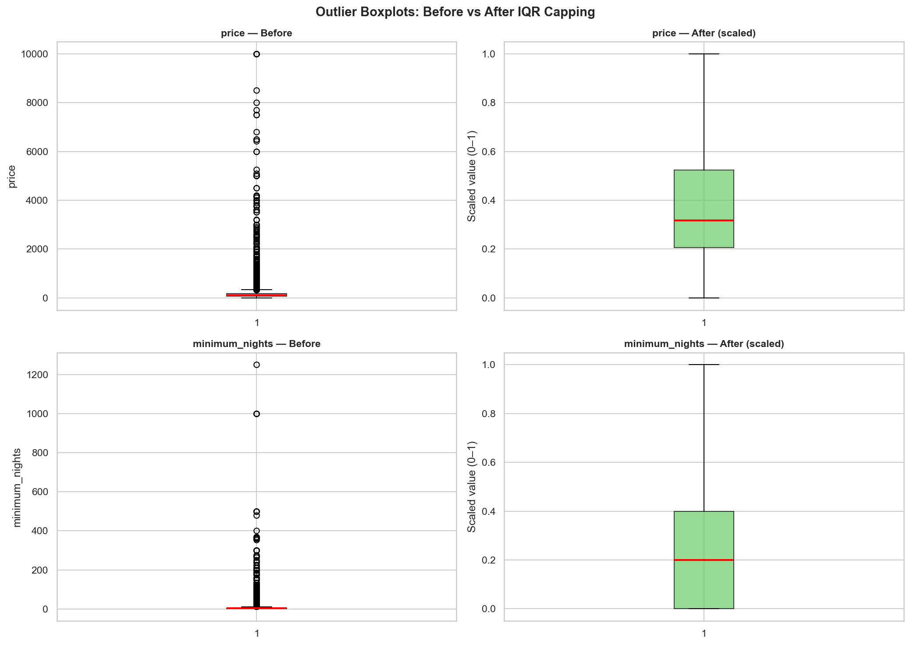
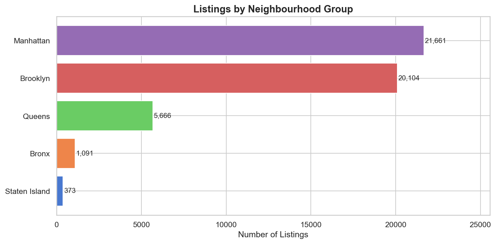
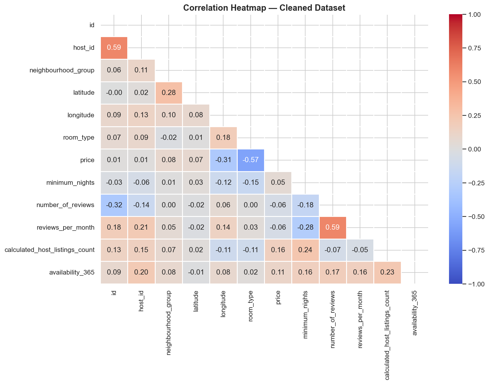

# nyc-airbnb-data-pipeline


A production-grade data preprocessing pipeline built in Python. Takes the
NYC Airbnb Open Dataset — one of the messiest real-world datasets available
— and transforms it into a clean, analysis-ready form through a fully
modular, reusable pipeline.

**Dataset → [NYC Airbnb Open Data](https://www.kaggle.com/datasets/dgomonov/new-york-city-airbnb-open-data)**
&nbsp;&nbsp;·&nbsp;&nbsp;
**Notebook → notebook.ipynb**
&nbsp;&nbsp;·&nbsp;&nbsp;
**Pipeline script → pipeline.py**

Raw data is rarely clean. This pipeline handles missing values, outliers,
duplicates, encoding, and scaling — then produces a full set of before/after
visualisations so every transformation is visible and explainable. The same
class-based architecture used here can be dropped into any data project.

---

## Table of Contents

0. [Prerequisites](#0-prerequisites)
1. [Quick start](#1-quick-start)
2. [Project structure](#2-project-structure)
3. [Pipeline blueprint](#3-pipeline-blueprint)
4. [Pipeline steps](#4-pipeline-steps)
5. [Visualisations](#5-visualisations)
6. [Key findings](#6-key-findings)
7. [Module reference](#7-module-reference)
8. [Dataset schema](#8-dataset-schema)
9. [Design decisions](#9-design-decisions)
10. [Dependencies](#10-dependencies)

---

## 0. Prerequisites

- Python 3.11+
- pip
- The dataset CSV (see Quick start — one `curl` command handles it)

---

## 1. Quick start

```bash
# 1. Clone the repository
git clone https://github.com/xavier-oc-programming/nyc-airbnb-data-pipeline.git
cd nyc-airbnb-data-pipeline

# 2. Create and activate a virtual environment
python3 -m venv venv
source venv/bin/activate        # Windows: venv\Scripts\activate

# 3. Install dependencies
pip install -r requirements.txt

# 4. Download the dataset into the project root
curl -L "https://raw.githubusercontent.com/erkansirin78/datasets/master/AB_NYC_2019.csv" \
     -o AB_NYC_2019.csv

# 5. Run the full pipeline (generates all charts in ./plots/)
python pipeline.py

# 6. (Optional) Open the notebook for a step-by-step walkthrough
jupyter notebook notebook.ipynb
```

---

## 2. Project structure

```
data-preprocessing-pipeline/
├── pipeline.py          # Main pipeline — DataLoader, DataCleaner, DataVisualizer, PipelineReport
├── notebook.ipynb       # Step-by-step walkthrough with inline visualisations
├── requirements.txt     # Pinned Python dependencies
├── .gitignore           # Ignores .csv, __pycache__, venv, etc.
├── AB_NYC_2019.csv      # Raw dataset (not tracked in git — download via Quick start)
└── plots/               # Auto-generated charts (created when pipeline.py runs)
    ├── 01_missing_heatmap.png
    ├── 02_price_distribution.png
    ├── 03_outlier_boxplots.png
    ├── 04_neighbourhood_breakdown.png
    └── 05_correlation_heatmap.png
```

---

## 3. Pipeline blueprint

`pipeline.py` is designed as a reusable blueprint — not a one-off script tied to this dataset. The four classes are independent of each other and can be imported individually into any data project. Point `DataLoader` at a different CSV, swap out the column names in `DataCleaner`, and the same cleaning logic applies.

| Class | Role | Import |
|---|---|---|
| `DataLoader` | Reads a CSV and surfaces shape, dtypes, sample rows, and per-column missing counts. No mutations — observation only. | `from pipeline import DataLoader` |
| `DataCleaner` | Applies all transformations in sequence: fill nulls → drop duplicates → cap outliers → encode categoricals → scale numerics. Every change is logged to an internal report dict. | `from pipeline import DataCleaner` |
| `DataVisualizer` | Takes the raw and clean DataFrames and generates five before/after diagnostic charts, saved to `./plots/`. | `from pipeline import DataVisualizer` |
| `PipelineReport` | Reads the report dict from `DataCleaner` and prints a formatted summary of every transformation applied. | `from pipeline import PipelineReport` |

Each class returns `self` from its transformation methods, so steps can be chained:

```python
cleaner = DataCleaner(raw_df)
clean_df = (
    cleaner
    .handle_missing_values()
    .remove_duplicates()
    .fix_outliers()
    .encode_categoricals()
    .scale_numerics()
    .get_clean_df()
)
```

---

## 4. Pipeline steps

The pipeline runs in a fixed sequence. Each step is a method on the relevant class; the entire sequence can be triggered with a single `python pipeline.py`.

### Step 1 — Load (`DataLoader.load`)

Reads `AB_NYC_2019.csv` into a Pandas DataFrame. The raw dataset contains **48,895 rows × 16 columns** and occupies 21.28 MB in memory.

### Step 2 — Inspect (`DataLoader.inspect`)

Prints shape, dtypes, three random sample rows, and a per-column missing-value table. This step produces no changes — it exists purely to surface the state of the data before any transformation.

**Key observations from inspection:**
- Only 4 of 16 columns have missing values
- `last_review` and `reviews_per_month` are both null for the exact same 10,052 rows (20.56 %) — listings that have never received a review
- `price` has a suspicious minimum of $0 (11 rows) and a maximum of $10,000 — both are handled at the outlier step

### Step 3 — Handle missing values (`DataCleaner.handle_missing_values`)

**Before:** 20,141 total missing cells across 4 columns  
**After:** 0 missing cells

| Column | Missing count | Strategy |
|---|---|---|
| `name` | 16 (0.03 %) | Filled with `'Unknown'` |
| `host_name` | 21 (0.04 %) | Filled with `'Unknown'` |
| `last_review` | 10,052 (20.56 %) | Filled with `'Unknown'` |
| `reviews_per_month` | 10,052 (20.56 %) | Filled with `0` |

No rows were dropped. All nulls were imputed.

### Step 4 — Remove duplicates (`DataCleaner.remove_duplicates`)

**Removed:** 0 duplicate rows. The dataset is already fully deduplicated (each `id` is unique), but this step is mandatory in any production pipeline to guard against ingestion-level copy errors.

### Step 5 — Fix outliers (`DataCleaner.fix_outliers`)

IQR capping is applied to `price` and `minimum_nights`. Values outside the fences are clamped to the fence value rather than dropped.

**`price`:**
- Q1 = $69, Q3 = $175, IQR = $106
- Floor = -$90 (effective floor = $0), Ceiling = **$334**
- Raw max: $10,000; 1,044 listings priced above $500
- **2,972 values capped** (6.1 % of rows)

**`minimum_nights`:**
- Q1 = 1, Q3 = 5, IQR = 4
- Ceiling = **11 nights**
- Some listings required 365+ night minimums — clear data-entry errors
- **6,607 values capped** (13.5 % of rows)

**Rows before / after:** 48,895 / 48,895 — no rows lost.

### Step 6 — Encode categoricals (`DataCleaner.encode_categoricals`)

`neighbourhood_group` (5 classes) and `room_type` (3 classes) are label-encoded to integers using `sklearn.preprocessing.LabelEncoder`.

### Step 7 — Scale numerics (`DataCleaner.scale_numerics`)

`price`, `minimum_nights`, and `number_of_reviews` are mapped to [0, 1] using `sklearn.preprocessing.MinMaxScaler`.

### Step 8 — Report (`PipelineReport.print_summary`)

A formatted summary is printed to stdout with before/after row counts, all imputation decisions, and outlier capping bounds.

---

## 5. Visualisations

All five charts are saved automatically to `./plots/` when `pipeline.py` runs.

### 01 — Missing value heatmap

Two visible bands of missing data at `last_review` and `reviews_per_month` — both null for the same 20.56 % of listings that have never been reviewed.



---

### 02 — Price distribution before and after

Before: extreme right skew with a long tail reaching $10,000.  
After: IQR capping brings all values to ≤ $334; MinMax scaling maps the distribution to [0, 1].



---

### 03 — Outlier boxplots

Before capping, both `price` and `minimum_nights` have upper whiskers that extend far beyond the interquartile range. After capping, the bounded scale makes the spread interpretable.



---

### 04 — Listings by neighbourhood group

Manhattan (21,661) and Brooklyn (20,104) together account for 85.4 % of all NYC Airbnb listings. Staten Island (373) represents just 0.76 % of supply.



---

### 05 — Correlation heatmap (clean data)

After cleaning, `calculated_host_listings_count` and `availability_365` show the strongest positive relationship. `number_of_reviews` correlates negatively with `price` — cheaper listings turn over more frequently and accumulate more reviews.



---

## 6. Key findings

All numbers are from a live run of the pipeline on the real dataset.

1. **One in five listings has never been reviewed.**  
   10,052 listings (20.56 %) have null `last_review` and `reviews_per_month`. These are active, priced listings — they simply have not yet received a guest review. Dropping them would silently remove a structurally distinct segment of the market.

2. **Manhattan and Brooklyn dominate supply.**  
   Manhattan holds 21,661 listings (44.3 %) and Brooklyn holds 20,104 (41.1 %), together 85.4 % of all NYC Airbnb inventory. The Bronx (1,091) and Staten Island (373) are marginal by comparison.

3. **Price outliers are severe — 6.1 % of listings exceed the IQR ceiling.**  
   The raw price range spans $0 to $10,000 with a mean of $152.72 and a median of $106. The IQR ceiling lands at $334. 2,972 listings (6.1 %) exceed this fence, and 11 listings are priced at exactly $0. Capping preserves these records while eliminating their distorting effect on downstream analysis.

4. **Entire homes lead at 52 %, but private rooms are nearly as common at 45.7 %.**  
   Room type distribution: Entire home/apt 52.0 %, Private room 45.7 %, Shared room 2.4 %. The near-even split between entire homes and private rooms reflects two structurally different business models operating side-by-side on the same platform.

5. **35.9 % of listings show zero availability for the coming year.**  
   17,533 listings have `availability_365 = 0`. These could be hosts who have paused activity, properties maintained purely for price signalling, or listings that fill instantly. They are worth flagging in any demand-modelling exercise.

---

## 7. Module reference

### `DataLoader`

| Method | Signature | Description |
|---|---|---|
| `__init__` | `(filepath: str = "AB_NYC_2019.csv") -> None` | Store the path to the raw CSV |
| `load` | `() -> pd.DataFrame` | Read the CSV and return the DataFrame |
| `inspect` | `() -> None` | Print shape, dtypes, sample rows, and missing-value counts |

### `DataCleaner`

| Method | Signature | Description |
|---|---|---|
| `__init__` | `(df: pd.DataFrame) -> None` | Copy the raw DataFrame and initialise the internal report dict |
| `handle_missing_values` | `() -> DataCleaner` | Fill or drop nulls per-column; returns `self` for chaining |
| `remove_duplicates` | `() -> DataCleaner` | Drop exact duplicate rows and log the count |
| `fix_outliers` | `() -> DataCleaner` | IQR-cap `price` and `minimum_nights`; returns `self` |
| `encode_categoricals` | `() -> DataCleaner` | Label-encode `neighbourhood_group` and `room_type` |
| `scale_numerics` | `() -> DataCleaner` | MinMaxScaler on `price`, `minimum_nights`, `number_of_reviews` |
| `get_clean_df` | `() -> pd.DataFrame` | Return the fully cleaned DataFrame |
| `get_report` | `() -> dict` | Return the internal cleaning report dictionary |

### `DataVisualizer`

| Method | Signature | Description |
|---|---|---|
| `__init__` | `(raw_df: pd.DataFrame, clean_df: pd.DataFrame) -> None` | Store raw and clean DataFrames |
| `missing_heatmap` | `() -> None` | Seaborn heatmap of nulls across all raw columns |
| `price_distribution_before_after` | `() -> None` | Side-by-side histograms of price before and after cleaning |
| `outlier_boxplots` | `() -> None` | 2×2 boxplot grid for price and minimum_nights before/after |
| `neighbourhood_breakdown` | `() -> None` | Horizontal bar chart of listings by neighbourhood_group |
| `correlation_heatmap` | `() -> None` | Lower-triangle Pearson correlation heatmap of clean numerics |
| `generate_all` | `() -> None` | Run all five methods in sequence |

### `PipelineReport`

| Method | Signature | Description |
|---|---|---|
| `__init__` | `(report: dict) -> None` | Store the report dict from `DataCleaner.get_report()` |
| `print_summary` | `() -> None` | Print a boxed summary of every transformation applied |

---

## 8. Dataset schema

All columns from `AB_NYC_2019.csv` and how the pipeline treats them.

| Column | Type | Description | Missing (%) | Pipeline treatment |
|---|---|---|---|---|
| `id` | int64 | Unique listing identifier | 0 % | Kept as-is |
| `name` | object | Listing title | 0.03 % | Fill → `'Unknown'` |
| `host_id` | int64 | Host identifier | 0 % | Kept as-is |
| `host_name` | object | Host display name | 0.04 % | Fill → `'Unknown'` |
| `neighbourhood_group` | object | Borough (Manhattan, Brooklyn, etc.) | 0 % | Label-encoded |
| `neighbourhood` | object | Specific neighbourhood name | 0 % | Kept as-is |
| `latitude` | float64 | Listing latitude | 0 % | Kept as-is |
| `longitude` | float64 | Listing longitude | 0 % | Kept as-is |
| `room_type` | object | Room category (Entire home/apt, Private room, Shared room) | 0 % | Label-encoded |
| `price` | int64 | Nightly price in USD | 0 % | IQR-capped then MinMax-scaled |
| `minimum_nights` | int64 | Minimum booking length in nights | 0 % | IQR-capped then MinMax-scaled |
| `number_of_reviews` | int64 | Total reviews received | 0 % | MinMax-scaled |
| `last_review` | object | Date of most recent review | 20.56 % | Fill → `'Unknown'` |
| `reviews_per_month` | float64 | Average reviews per calendar month | 20.56 % | Fill → `0` |
| `calculated_host_listings_count` | int64 | Total active listings by the host | 0 % | Kept as-is |
| `availability_365` | int64 | Days available for booking in the next year | 0 % | Kept as-is |

---

## 9. Design decisions

### Why IQR capping instead of dropping outliers

Dropping rows with outlier prices would remove real listings — a $2,000/night Manhattan penthouse is not bad data, it is a legitimate part of the market. The IQR method identifies the boundary of the typical price range (Q3 + 1.5·IQR = $334) and clamps extreme values to that boundary rather than discarding the row. The listing remains in the dataset with a plausible value that no longer distorts aggregate statistics. The same logic applies to `minimum_nights`: a listing requiring 365 minimum nights is almost certainly a data-entry error, but capping to 11 nights retains the record while correcting the outlying value.

### Why MinMaxScaler instead of StandardScaler

StandardScaler assumes the feature follows a roughly Gaussian distribution and produces a z-score centered at 0 with unit variance. `price`, `minimum_nights`, and `number_of_reviews` are all heavily right-skewed even after outlier capping — for these distributions, z-score standardisation would produce a scale that is neither intuitive nor particularly useful. MinMaxScaler maps every value to [0, 1] regardless of distribution shape, which is directly interpretable ("0 = minimum observed, 1 = maximum observed after capping") and works equally well as StandardScaler for distance-based and tree-based models.

### Why label encoding instead of one-hot encoding for neighbourhood_group and room_type

One-hot encoding is the default choice when category order is meaningless, but it adds k-1 new columns for k categories. With only 5 borough groups and 3 room types, one-hot encoding would add 6 extra columns that carry redundant information for the primary use case here — feature preparation for a model that will treat each column as an independent numeric input. Label encoding keeps the schema compact, is trivially reversible, and for low-cardinality columns does not introduce any meaningful bias in tree-based models. If this dataset were fed into a linear model where ordinal assumptions matter, one-hot encoding would be the right call.

### Why class-based architecture instead of a flat script of functions

A flat script of functions works for a one-off analysis but makes reuse harder: you cannot import just the cleaning logic without also importing the visualisation logic, you cannot test individual transformations in isolation, and there is no obvious place to store state like the cleaning report. The class-based architecture here separates concerns cleanly — `DataLoader` handles I/O, `DataCleaner` manages all mutations and their metadata, `DataVisualizer` owns all chart logic, and `PipelineReport` owns output formatting. Each class can be imported and instantiated independently in any downstream project (`from pipeline import DataCleaner`), tested against mock DataFrames, or extended with new methods without touching the other classes.

---

## 10. Dependencies

| Package | Used in | Purpose |
|---|---|---|
| `pandas` | `pipeline.py`, `notebook.ipynb` | DataFrame I/O, manipulation, missing-value handling |
| `numpy` | `pipeline.py`, `notebook.ipynb` | Numerical operations, IQR calculation, array ops |
| `matplotlib` | `pipeline.py`, `notebook.ipynb` | Base charting engine for all five visualisations |
| `seaborn` | `pipeline.py`, `notebook.ipynb` | Statistical chart themes, missing-value heatmap, correlation heatmap |
| `scikit-learn` | `pipeline.py` | `LabelEncoder` (categorical encoding) and `MinMaxScaler` (feature scaling) |
| `jupyter` | `notebook.ipynb` | Notebook server for the interactive walkthrough |
| `ipykernel` | `notebook.ipynb` | Jupyter kernel for Python execution inside the notebook |
| `nbformat` | `notebook.ipynb` | Notebook format serialisation (used by nbconvert for CI validation) |
